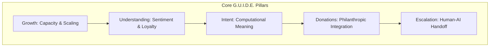

# G.U.I.D.E. Platform

**Human-Centered AI for Customer Service & Philanthropy**

The G.U.I.D.E. Platform is a comprehensive framework designed to harmonize generative AI and agentic systems with the nuanced requirements of human-centered service and philanthropy.

---

## 🏗 Framework Architecture

## 🚀 Key Pillars

### 📈 Growth (Capacity & Organizational Scaling)
- **Extra Staff Capacity:** Automating routine tasks to redirect human intelligence to high-value mission work.
- **Economic Impact:** AI-driven tools can increase revenue by up to 30%.
- **Data Modernization:** Unlocking information from silos (CRM, Accounting, Email).

### 🧠 Understanding (Sentiment & Loyalty)
- **Sentimental Intelligence:** Deep semantic comprehension over keyword matching.
- **R.O.D.E.S. Framework:** Structured prompting for brand voice alignment (Role, Objective, Details, Examples, Sense Check).
- **Loyalty Loop:** Proactive engagement based on "Voice of the Customer" (VOC) analysis.

### 🎯 Intent (Computational Meaning)
- **Neural Model Performance:** High-accuracy intent detection (90%+) using LLMs.
- **Multi-Intent Decomposition:** Breaking down complex queries into structured actionable arrays.
- **Sentiment-Aware Routing:** Prioritizing urgent or high-frustration intents.

### 💖 Donations (Philanthropic Integration)
- **Behavioral AI:** Optimizing the giving journey with real-time behavioral data (e.g., Fundraise Up).
- **Friction-Free Integration:** "Buttery smooth" giving prompts directly in interactions.
- **Risk Mitigation:** Clustering micro-transactions to prevent "agentic smurfing."

### 🪜 Escalation (Human-AI Handoff)
- **Autonomy Pyramid:** Categorizing tasks (Act, Advise, Illuminate, Automate).
- **Context Preservation:** Seamlessly passing conversation history and metadata to human agents.
- **Deterministic Triggers:** Automatic handoff for low-confidence or high-risk tasks.

---

## 🗺 Roadmap

| Phase | Timeline | Deliverables |
| :--- | :--- | :--- |
| **Phase I: Audit** | Days 1-30 | AI Readiness Report & Governance Framework |
| **Phase II: Pilot** | Days 31-60 | Pilot Performance Evaluation & ROI Baseline |
| **Phase III: Scale** | Days 61-90 | Global Rollout & Stewardship Council |

---

## ⚖️ Ethical Governance
Built on **Human-Centered AI (HCAI)** principles:
- **Maintain Agency:** Human control in high-stakes situations.
- **Transparency:** Visible decision-making paths.
- **Bias Mitigation:** Active identification and elimination of algorithmic bias.
- **Digital Stewardship:** Discernment, Accompaniment, and Attunement.

---

## 🛠 Tech Stack
- **Language Models:** LLMs (OpenAI, Anthropic) via LangChain/LangGraph.
- **Integration:** Zapier, Make.com, Microsoft Copilot Studio.
- **Security:** OAuth 2.0, PII Redaction, SIP Trunking.

## 🤝 Contributing
Please read [CONTRIBUTING.md](CONTRIBUTING.md) for details on our code of conduct and the process for submitting pull requests.

## 📄 License
This project is licensed under the MIT License - see the [LICENSE](LICENSE) file for details.
